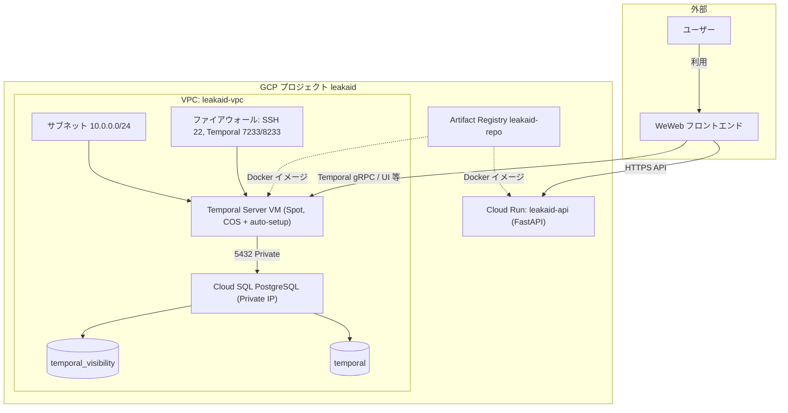

# LeakAid

## 概要

（プロジェクトの説明をここに記載してください）

## システム構成図

本システムは GCP 上で Temporal（ワークフローエンジン）と FastAPI（API）を稼働させ、フロントエンドは外部サービス WeWeb を利用する構成です。



- **VPC 内**: サブネット・ファイアウォール、Temporal Server VM、Cloud SQL（Private IP で VPC に接続）。コンピュートと DB は VPC 内で閉じた通信。
- **VPC 外（GCP マネージド）**: Cloud Run、Artifact Registry。Cloud Run は必要に応じて VPC コネクタで VPC 内リソースへアクセス可能。
- **フロントエンド**: ユーザーは WeWeb を利用。WeWeb から Cloud Run（API）および Temporal Server へ接続。

| リソース | 説明 |
|----------|------|
| **WeWeb** | 外部のフロントエンドサービス。ユーザーはここにアクセスする。 |
| **Temporal Server VM** | Spot VM。起動時に temporalio/auto-setup で Temporal を起動。 |
| **Cloud SQL** | Temporal の永続化（PostgreSQL）。Private IP のみで VPC 内からアクセス。 |
| **Cloud Run** | FastAPI デプロイ用。WeWeb やクライアントから API 呼び出し。 |
| **Artifact Registry** | アプリ用 Docker イメージの格納先（VPC 外のマネージドサービス）。 |

## セットアップ

（手順をここに記載してください）

## **Supabase Schema**

以下のテーブルは Supabase（Postgres） に存在します。README にテーブル定義を記載しておきます。

```sql
-- ==========================================
-- 1. ユーザー管理 (auth.usersとの紐付け)
-- ==========================================
CREATE TABLE public.profiles (
  id uuid REFERENCES auth.users ON DELETE CASCADE PRIMARY KEY,
  email TEXT UNIQUE,
  created_at TIMESTAMPTZ DEFAULT NOW()
);

-- ==========================================
-- 2. 削除依頼の親レコード
-- ==========================================
CREATE TABLE public.removal_requests (
  id uuid DEFAULT gen_random_uuid() PRIMARY KEY,
  user_id uuid REFERENCES public.profiles(id) ON DELETE CASCADE NOT NULL,
  status TEXT DEFAULT 'pending' CHECK (status IN ('pending', 'scanning', 'processing', 'completed')),
  master_image_path TEXT, -- 検索元画像のStorageパス
  created_at TIMESTAMPTZ DEFAULT NOW()
);

-- ==========================================
-- 3. 詳細な質問票 (バージョン管理・法的属性)
-- ==========================================
CREATE TABLE public.request_details (
  id uuid DEFAULT gen_random_uuid() PRIMARY KEY,
  request_id uuid REFERENCES public.removal_requests(id) ON DELETE CASCADE,
  schema_version TEXT NOT NULL,         -- 例: '2026.05.v1'
  
  -- 権利関係（AIが申請戦略を立てるために使用）
  is_self_shot BOOLEAN,                 -- 自撮りか？
  filming_consent BOOLEAN,              -- 撮影同意の有無
  publishing_consent BOOLEAN DEFAULT FALSE, -- 公開同意（通常はFALSE）
  age_at_filming INTEGER,               -- 撮影時年齢（18歳未満は最優先）
  
  -- 加害者・コンテキスト情報
  uploader_relationship TEXT,           -- 関係性
  uploader_account_url TEXT,            -- 相手のSNS等
  incident_context TEXT,                -- 被害の経緯詳細
  raw_answers jsonb,                    -- 拡張用
  
  created_at TIMESTAMPTZ DEFAULT NOW()
);

-- ==========================================
-- 4. 個別の被害URL管理 (タスクリスト)
-- ==========================================
CREATE TABLE public.target_urls (
  id uuid DEFAULT gen_random_uuid() PRIMARY KEY,
  request_id uuid REFERENCES public.removal_requests(id) ON DELETE CASCADE,
  url TEXT NOT NULL,
  website_name TEXT,                    -- サイト名（Pornhub, X等）
  image_hash TEXT,                      -- 画像の指紋（再発検知用）

  -- 二段階ステータス
  source_status TEXT DEFAULT 'active' 
    CHECK (source_status IN ('active', 'removed_404', 'failed')), -- 元サイト
  search_status TEXT DEFAULT 'indexed' 
    CHECK (search_status IN ('indexed', 'deindexed', 'not_applicable')), -- 検索エンジン

  last_scanned_at TIMESTAMPTZ,
  created_at TIMESTAMPTZ DEFAULT NOW()
);

-- ==========================================
-- 5. ワークフロー実行ログ (Temporal連携・デバッグ用)
-- ==========================================
CREATE TABLE public.url_workflow_logs (
  id uuid DEFAULT gen_random_uuid() PRIMARY KEY,
  target_url_id uuid REFERENCES public.target_urls(id) ON DELETE CASCADE,
  
  workflow_type TEXT NOT NULL,          -- ワークフローの種類
  temporal_workflow_id TEXT,            -- TemporalのID
  
  -- 実行詳細（Temporalを見なくても良い情報量）
  input_params jsonb,                   -- 何を入力して実行したか
  output_result jsonb,                  -- 実行結果の戻り値
  execution_error_detail TEXT,          -- 失敗時の詳細エラーメッセージ
  
  status TEXT CHECK (status IN ('running', 'completed', 'failed')),
  started_at TIMESTAMPTZ DEFAULT NOW(),
  finished_at TIMESTAMPTZ
);

-- ==========================================
-- 6. ブラウザセッション共有 (Playwright用)
-- ==========================================
CREATE TABLE public.storage_states (
  id uuid DEFAULT gen_random_uuid() PRIMARY KEY,
  user_id uuid REFERENCES public.profiles(id) ON DELETE CASCADE,
  platform_name TEXT NOT NULL,          -- 'google', 'twitter'等
  state_json jsonb NOT NULL,            -- storageStateデータ
  updated_at TIMESTAMPTZ DEFAULT NOW()
);

-- ==========================================
-- コメントの追加（AIが理解するためのメタデータ）
-- ==========================================
COMMENT ON TABLE public.request_details IS '法的な申請に必要な本人の属性情報。schema_versionで形式を管理。';
COMMENT ON COLUMN public.target_urls.source_status IS '元サイトからコンテンツが物理的に消滅したか。';
COMMENT ON COLUMN public.target_urls.search_status IS 'Google等の検索インデックスから除外されたか。';
COMMENT ON TABLE public.url_workflow_logs IS 'Temporalの実行履歴。input_paramsとoutput_resultでデバッグが可能。';
```

## ライセンス

（ライセンスを記載してください）
