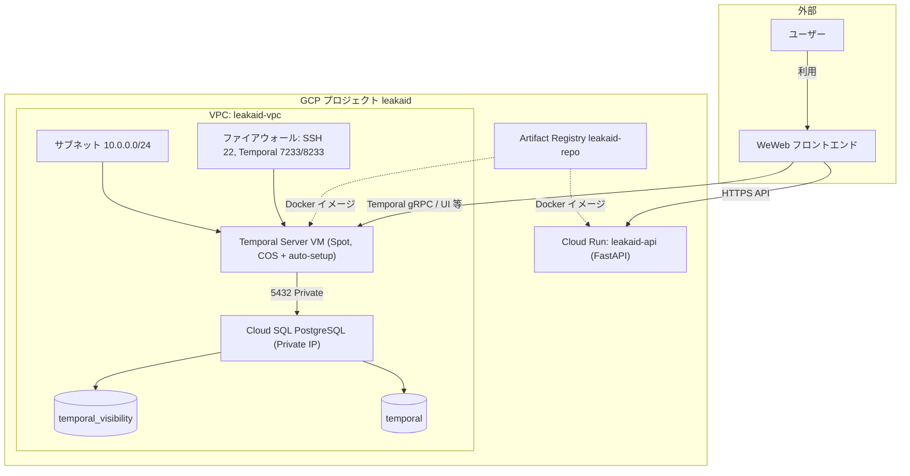

# LeakAid

## 概要

（プロジェクトの説明をここに記載してください）

## システム構成図

本システムは GCP 上で Temporal（ワークフローエンジン）と FastAPI（API）を稼働させ、フロントエンドは外部サービス WeWeb を利用する構成です。

- **VPC 内**: サブネット・ファイアウォール、Temporal Server VM、Cloud SQL（Private IP で VPC に接続）。コンピュートと DB は VPC 内で閉じた通信。
- **VPC 外（GCP マネージド）**: Cloud Run、Artifact Registry。Cloud Run は必要に応じて VPC コネクタで VPC 内リソースへアクセス可能。
- **フロントエンド**: ユーザーは WeWeb を利用。WeWeb から Cloud Run（API）および Temporal Server へ接続。

| リソース | 説明 |
|----------|------|
| **WeWeb** | 外部のフロントエンドサービス。ユーザーはここにアクセスする。 |
| **Temporal Server VM** | Spot VM。起動時に temporalio/auto-setup で Temporal を起動。 |
| **Cloud SQL** | Temporal の永続化（PostgreSQL）。Private IP のみで VPC 内からアクセス。 |
| **Cloud Run** | FastAPI デプロイ用。WeWeb やクライアントから API 呼び出し。 |
| **Artifact Registry** | アプリ用 Docker イメージの格納先（VPC 外のマネージドサービス）。 |

## セットアップ

（手順をここに記載してください）

## ライセンス

（ライセンスを記載してください）
